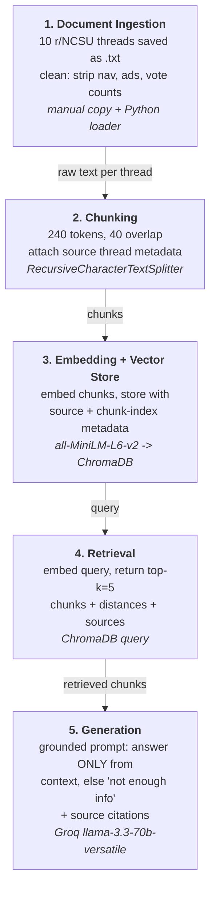

# Project 1 Planning: The Unofficial Guide

> Write this document before you write any pipeline code.
> Your spec and architecture diagram are what you'll use to direct AI tools (Claude, Copilot, etc.) to generate your implementation — the more specific they are, the more useful the generated code will be.
> Update the Retrieval Approach and Chunking Strategy sections if you change your approach during implementation.
> Update this file before starting any stretch features.

---

## Domain

I'm building this around off-campus student housing near NC State, apartment reviews, hidden costs, neighborhood safety, and how realistic the Wolfline bus access actually is for each complex.

The reason this is worth doing is that the official sources are basically useless for an honest decision. Apartment websites use staged photos, leave parking and utility fees off the headline rent, and their Google reviews are heavily padded by management. The information you actually need, which buildings have non-opening windows, which management company tows your car, what a 4x4 really costs once you add everything up, only lives in scattered Reddit threads on r/NCSU. It's all there, but it's spread across years of comments and nobody has put it in one place. A student trying to research this manually would have to read dozens of threads and cross-reference them by hand. That's exactly the kind of buried, real knowledge a RAG system is good for.

---

## Documents

All ten sources are r/NCSU threads. I picked them so they don't overlap much, each one leans toward a different subtopic, so the corpus covers a real range of questions instead of ten threads all saying "I liked my place."

| #   | Source                                                              | File Name                                 | Description                                                                                         | URL or location                                                                                |
| --- | ------------------------------------------------------------------- | ----------------------------------------- | --------------------------------------------------------------------------------------------------- | ---------------------------------------------------------------------------------------------- |
| 1   | What off campus apartments do you recommend?                        | 01_ncsu_general_recommendations.txt       | General overview + budget picks; maintenance responsiveness and walking commute near Dan Allen deck | https://www.reddit.com/r/NCSU/comments/1c4veee/what_off_campus_apartments_do_you_recommend_or/ |
| 2   | [Safety Alert] Prowler / Casing Houses near Avent Ferry & Socket Dr | 02_avent_ferry_safety_prowler.txt         | Real neighborhood safety, doorbell footage, casing reports, police involvement in student areas     | https://www.reddit.com/r/NCSU/comments/1trnl1b/safety_alert_prowler_casing_houses_near_avent/  |
| 3   | Off Campus Housing Advice Needed                                    | 03_hidden_fees_parking_costs.txt          | Hidden cost breakdown: College Inn $710 (+$50 parking) vs The Standard $900 (+$130 parking + fees)  | https://www.reddit.com/r/NCSU/comments/12fsevy/off_campus_housing_advice_needed/               |
| 4   | NC State Apartment Living                                           | 04_hillsborough_commuting_subleases.txt   | Hillsborough commute, code locks, appliance replacement policy, sublease room pricing               | https://www.reddit.com/r/NCSU/comments/1g87da8/nc_state_apartment_living/                      |
| 5   | Off Campus Housing Mega thread                                      | 05_spotting_fake_corporate_reviews.txt    | How corporate managers manipulate Google review scores; spotting padded ratings                     | https://www.reddit.com/r/NCSU/comments/brtjus/off_campus_housing/                              |
| 6   | Off Campus Housing: University Woods                                | 06_university_woods_leaks_budget.txt      | Older/cheaper builds, ceiling leaks but utilities included                                          | https://www.reddit.com/r/NCSU/comments/12bjdtd/off_campus_housing/                             |
| 7   | Opinions on "The Wilde" Apartments                                  | 07_the_wilde_predatory_towing.txt         | Predatory towing contracts, vehicle damage, hostile management                                      | https://www.reddit.com/r/NCSU/comments/12tonfj/opinions_on_the_wilde_apartments/               |
| 8   | Off-campus housing - Trinity properties                             | 08_trinity_properties_gorman_crossing.txt | Affordable complexes + transit; Gorman Crossing, grad-student housing Discord/WhatsApp channels     | https://www.reddit.com/r/NCSU/comments/w44ieh/offcampus_housing_trinity_properties/            |
| 9   | No openable windows at The Standard                                 | 09_the_standard_window_safety_hazards.txt | Structural safety, fire hazard, smoke, lack of secondary exits in newer builds                      | https://www.reddit.com/r/NCSU/comments/1ts9070/no_openable_windows_at_the_standard/            |
| 10  | Valentine Commons reviews                                           | 10_valentine_commons_infrastructure.txt   | Infrastructure, plumbing, broken elevators, Wi-Fi reliability, no overhead lighting                 | https://www.reddit.com/r/NCSU/comments/1no6n56/valentine_commons_reviews/                      |

---

## Chunking Strategy

**Chunk size:** 240 tokens _(revised down from an original plan of 500–700 — see note below)_

**Overlap:** 40 tokens _(originally 100–150)_

**Reasoning:**

These threads are messy and conversational, not clean long-form guides. A typical useful comment names a specific apartment in the first sentence and then drops the actual fact, the parking pass amount, the towing company name, the leak, a few sentences later. So the apartment name and the evidence are usually in the same comment but separated by a couple of sentences.

That's why I'm not doing sentence-level chunking: it would split the complex name away from the complaint, and a chunk like "the parking pass is $130 a month" with no apartment attached is useless to retrieve. I use a recursive character splitter, so it tries to break on blank-line, then line, then sentence boundaries first rather than cutting mid-sentence, and I prepend each thread's title to its text so the apartment being discussed is present in the chunks.

**Why the numbers changed (Milestone 3 finding):** I originally specified 500–700 tokens / 100–150 overlap. When I built the pipeline and ran chunk-inspection tests (`test_chunks.py`), two things failed: (1) it produced only **34 chunks** across 10 docs, below the ~50 floor the instructions warn about, meaning each chunk covered too much to match a specific query; and (2) **85% of chunks exceeded all-MiniLM-L6-v2's 256-token limit**, so their tails would be silently truncated at embedding time and never actually searched. I resized to **240 tokens** with **40-token overlap**. That yields **84 chunks**, median ~193 tokens, all within the embedding window. I also added a post-split merge step so a chunk that ends up being just a stranded "Comment by u/…" header gets glued back onto its comment body.

---

## Retrieval Approach

**Embedding model:** all-MiniLM-L6-v2 via sentence-transformers, runs locally, no API key, no rate limits. It's fine for short opinion text like this and keeps the whole pipeline free.

**Top-k:** Starting at k=5. Since facts about one complex are scattered across several threads, I want enough chunks that the relevant evidence actually makes it into the set, but not so many that I pull in loosely related comments about other apartments and confuse the LLM. I'll tune this once I see real retrieval results, if answers are missing context I'll raise it, if they're getting muddy I'll lower it.

**Production tradeoff reflection:**

If this were a real deployment and cost wasn't the issue, the main thing I'd reconsider is accuracy on domain-specific text. all-MiniLM is small and general; a larger embedding model would likely do better at telling apart two complexes that get discussed in very similar language. Context length matters less here because my chunks are short. Multilingual support isn't really needed, these threads are all English. The real tradeoff is latency and cost vs. retrieval precision: local MiniLM is instant and free but blunter; an API model is sharper but adds per-query cost and a network round-trip.

---

## Evaluation Plan

| #   | Question                                                                             | Expected answer                                                                                                                                                                                                 |
| --- | ------------------------------------------------------------------------------------ | --------------------------------------------------------------------------------------------------------------------------------------------------------------------------------------------------------------- |
| 1   | What are the hidden fees and parking costs at the budget complexes students mention? | Students stress the advertised rent isn't the real cost: parking is billed separately and varies a lot by complex — roughly $40/mo (College Inn) up to $130–$150/mo (The Standard, The Hillsborough) — plus utility/admin fees. Budget 4×4 rents run ~$700–$800 (College Inn ~$710), pricier Hillsborough-area builds ~$900 (The Standard). (sources: 03_hidden_fees_parking_costs.txt, 05_spotting_fake_corporate_reviews.txt) |
| 2   | Is there a safety concern reported near Avent Ferry and Socket Dr?                   | Yes, a prowler/casing-houses alert with doorbell-camera footage and police reports in the off-campus student area (source: 02_avent_ferry_safety_prowler.txt).                                                  |
| 3   | Which management company do students say tows cars or damages vehicles?              | The Wilde, students report predatory towing contracts, vehicle damage, and hostile management (source: 07_the_wilde_predatory_towing.txt).                                                                      |
| 4   | What's the window/fire-safety problem students raise about The Standard?             | The windows don't open, which students flag as a fire/smoke hazard with no good secondary exit in the newer build (source: 09_the_standard_window_safety_hazards.txt).                                          |
| 5   | At Valentine Commons, what infrastructure problems do reviewers report?              | Plumbing issues, broken elevators, unreliable Wi-Fi, and no overhead room lighting (source: 10_valentine_commons_infrastructure.txt).                                                                           |

---

## Anticipated Challenges

1. **Apartment name and the fact getting split apart:** Because reviewers mention the complex early and the specific detail later, a bad chunk boundary can leave the dollar amount or the towing complaint floating with no apartment attached. That chunk would still embed and could get retrieved, but it'd answer the wrong question or none at all. My overlap is meant to soften this, but it's the failure I expect to actually hit, and I'll be watching for it when I inspect chunks.

2. **Cross-complex confusion in retrieval:** A lot of these comments use near-identical language, "management never responds," "parking is a nightmare," about different buildings. Semantic search could easily pull a complaint about The Wilde when I asked about Valentine Commons, since the wording is so similar. If I see this, the fix is tighter chunks that keep the name bound to the detail, or adding the source/apartment as metadata I can lean on.

3. **Source attribution on Reddit content:** Everything traces back to a thread, not a tidy document, so I need to make sure each chunk carries its source thread as metadata from the start, otherwise citations at the end will be guesswork.

---

## Architecture

---

## AI Tool Plan

**Milestone 3 — Ingestion and chunking:**
I'll hand Claude this Documents section (so it knows the inputs are pasted-in Reddit threads saved as .txt, not live scrapes) plus my Chunking Strategy section and the diagram. I'll ask it to write a loader that reads each .txt file, a cleaning pass that strips Reddit boilerplate (vote counts, "Continue this thread", "Read more", share/award junk), and a chunking step using a recursive character splitter, attaching the source thread name to each chunk. What I'm checking: that it respects my chunk numbers, that it actually keeps source metadata, and that cleaning doesn't eat real review text. I'll print 5 chunks and read them myself before trusting it. _(Outcome: this is where I found the 500–700 token plan didn't fit the embedding model and revised to 240/40 — see the Chunking Strategy note.)_

**Milestone 4 — Embedding and retrieval:**
I'll give Claude the Retrieval Approach section and the diagram and ask it to embed the chunks with all-MiniLM-L6-v2, load them into ChromaDB with source + chunk-index metadata, and write a `retrieve(query, k=5)` that returns chunks with distance scores and sources. If it uses any Chroma API I don't recognize I'll ask it to explain it. I'll verify by running 3 of my eval questions and checking the distances are below ~0.5 and the chunks are actually on-topic., not just sharing a couple words.

**Milestone 5 — Generation and interface:**
I'll prompt Claude with my grounding requirement (answer only from retrieved context, refuse with "I don't have enough information" otherwise), the output format I want (answer + list of source threads), and ask for a Groq `llama-3.3-70b-versatile` call plus the Gradio skeleton from the instructions. Before running it I'll read the system prompt to confirm grounding is actually enforced, and make sure sources are appended programmatically from metadata rather than left to the model to invent. I'll test it on an in-scope query, a near-miss, and one totally out-of-scope question to confirm it declines instead of bluffing.
